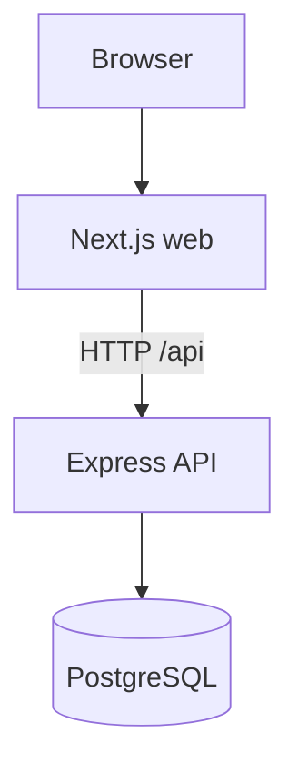

# DevStore architecture

DevStore is a fullstack application with a browser storefront (Next.js), a JSON API (Express + Prisma), PostgreSQL, and Docker for local runtime.

## High-level diagram

## Request paths

| Path | Served by | Notes |
|------|-----------|-------|
| `/` | Next.js | UI and static assets |
| `/api/*` | Express | Application REST endpoints |

For local Docker Compose, the browser calls the API at `http://localhost:4000` using `NEXT_PUBLIC_API_URL`.

## Versioning model (V1 -> V3)

Releases are feature tiers in one codebase:

| Tier | UI | API |
|------|----|-----|
| v1 | Core storefront only | Wishlist + ops routes return 404 |
| v2 | Wishlist navigation + hearts | `/api/wishlist/*` enabled |
| v3 | Reliability messaging + timeline UI | `/api/ops/summary` enabled |

`APP_RELEASE` and `NEXT_PUBLIC_APP_RELEASE` are set per environment.

## Data model

PostgreSQL stores products, carts, orders, reviews, and (from v2) wishlist rows. Prisma schema lives in `prisma/schema.prisma`.
